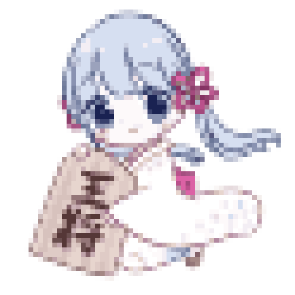

# pixnoa

画像をドット絵に変換するデスクトップアプリケーションです。OpenCVを用いた画像処理により、選んだ画像をレトロゲーム風のドット絵に変換します。

## 主な機能

- 画像の選択・プレビュー表示
- ドットサイズ・色数をスライダーで調整し、変更のたびにリアルタイムで再変換
- 背景が透過されたPNG画像にも対応（透過情報を保持したまま変換）
- 変換後の画像をPNGファイルとして書き出し（保存先に同名ファイルがある場合は上書き確認）

## スクリーンショット

| 元画像 | 変換後 |
| --- | --- |
|  |  |

イラスト素材：フリー素材キャラクター「つくよみちゃん」([https://tyc.rei-yumesaki.net/](https://tyc.rei-yumesaki.net/))

## 使用技術

- [Kotlin Multiplatform](https://kotlinlang.org/docs/multiplatform.html)
- [Compose Multiplatform](https://www.jetbrains.com/compose-multiplatform/)（Desktop/JVM）
- [OpenCV](https://opencv.org/)（[JavaCV](https://github.com/bytedeco/javacv) 経由）
- Kotlin Coroutines

## アーキテクチャ

MVVM + Clean Architectureを採用し、`ui` / `domain` / `data` の3層に分離しています。

```
composeApp/src/jvmMain/kotlin/org/example/pixnoa/
├── ui/       # 画面・ViewModel・UIコンポーネント
├── domain/   # ドメインモデル・ユースケース・リポジトリインターフェース
└── data/     # リポジトリ実装・OpenCV/ファイルI/Oなどの実処理
```

## ビルド・実行方法

### 開発時の起動

- macOS/Linux
  ```shell
  ./gradlew :composeApp:run
  ```
- Windows
  ```shell
  .\gradlew.bat :composeApp:run
  ```

### テストの実行

```shell
./gradlew jvmTest
```

### 配布用パッケージの作成

```shell
./gradlew packageDmg   # macOS
./gradlew packageMsi   # Windows
```

---

参考: [Kotlin Multiplatform](https://kotlinlang.org/docs/multiplatform/get-started.html)
